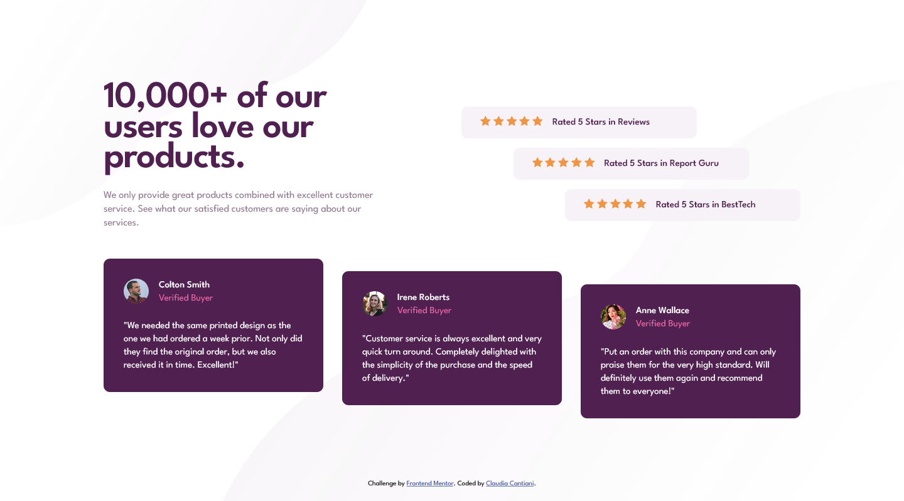
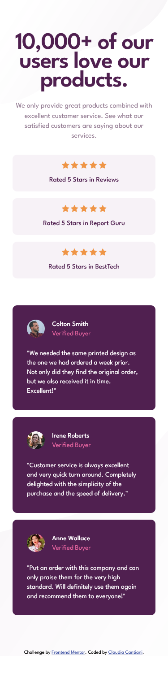

# Frontend Mentor - Social proof section solution

This is a solution to the [Social proof section challenge on Frontend Mentor](https://www.frontendmentor.io/challenges/social-proof-section-6e0qTv_bA). Frontend Mentor challenges help you improve your coding skills by building realistic projects.

## Table of contents

- [Overview](#overview)
  - [The challenge](#the-challenge)
  - [Screenshot](#screenshot)
  - [Links](#links)
- [My process](#my-process)
  - [Built with](#built-with)
  - [What I learned](#what-i-learned)
  - [Continued development](#continued-development)
  - [Useful resources](#useful-resources)
- [Author](#author)

## Overview

### The challenge

Users should be able to:

- View the optimal layout for the section depending on their device's screen size

### Screenshot

### Links

- Solution URL: [Add solution URL here](https://www.frontendmentor.io/solutions/responsive-section-using-grid-and-flexbox-rJQgcVv4q)
- Live Site URL: [Add live site URL here](https://cla91.github.io/social-proof-section-master/)

## My process

### Built with

- Semantic HTML5 markup
- CSS custom properties
- Flexbox
- CSS Grid
- Mobile-first workflow

### What I learned

I tried to use grid and flexbox for responsiveness instead of media queries. It wasn't easy.
I added the media queries to adjust some parts like alignment, text and background.
I turned the testimonial part from flexbox to grid in larger screen because I didn't like the wrap of grid in smaller screen (it's like a table), instead using flexbox for the smaller screen the wrapped element is in the center below the other.

### Continued development

I certainly have to practice more and more flexbox and grid. Especially using both of them together.

### Useful resources

- [CSS Tricks](https://css-tricks.com/) - As always when I have a problem, I end up here.

## Author

- Frontend Mentor - [@cla91](https://www.frontendmentor.io/profile/cla91)
